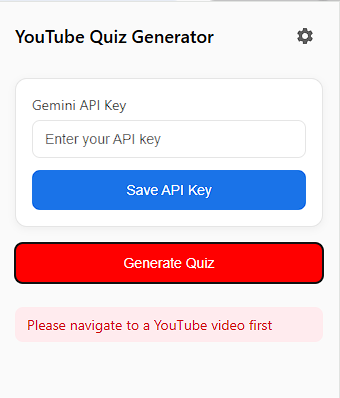

# YouTube Quiz Generator Chrome Extension

A Chrome extension that automatically generates quizzes from YouTube videos using Google's Gemini AI. Learn while you watch by testing your understanding of video content!



## Features

- 🤖 AI-powered quiz generation using Google's Gemini AI
- 📝 Automatically extracts video content and generates relevant questions
- 🎯 Multiple choice questions with instant feedback
- 🎨 Clean, YouTube-style interface
- 💾 Persistent API key storage
- ✨ Works with any YouTube video that has captions/transcript

## Setup Instructions

### 1. Get Gemini API Key

1. Go to [Google AI Studio](https://makersuite.google.com/app/apikey)
2. Sign in with your Google account
3. Click "Create API Key"
4. Copy your API key for later use

### 2. Install the Extension

#### Method A: From Release
1. Download the latest release from the [releases page](../../releases)
2. Unzip the downloaded file

#### Method B: From Source
1. Clone this repository:
```bash
git clone https://github.com/yourusername/youtube-quiz-generator.git
```

2. Install in Chrome:
   - Open Chrome and go to `chrome://extensions/`
   - Enable "Developer mode" in the top right
   - Click "Load unpacked"
   - Select the extension directory

### 3. Configure the Extension

1. Click the extension icon in Chrome's toolbar
2. Click the gear icon (⚙️)
3. Paste your Gemini API key
4. Click "Save API Key"

## Usage

1. Go to any YouTube video
2. Click the extension icon
3. Click "Generate Quiz"
4. Answer the questions
5. Click "Submit" to see your results

## Development

### Project Structure
```
youtube-quiz-generator/
├── manifest.json     # Extension configuration
├── popup.html       # Extension popup interface
├── popup.js         # Popup logic and quiz display
├── content.js       # YouTube page integration
└── README.md        # Documentation
```

### Building from Source

1. Clone the repository
2. Make your modifications
3. Test locally using Chrome's "Load unpacked" feature
4. Create a pull request with your changes

## Technical Details

- Uses Chrome Extension Manifest V3
- Integrates with Google's Gemini AI API
- Extracts video transcripts using YouTube's built-in functionality
- Implements modern JavaScript features
- Uses CSS Grid and Flexbox for layouts

## Privacy

- The extension only accesses YouTube video transcripts
- Your Gemini API key is stored locally in Chrome's storage
- No data is collected or transmitted except to generate quizzes via Gemini API

## Contributing

Contributions are welcome! Please feel free to submit a Pull Request.

1. Fork the repository
2. Create your feature branch
3. Commit your changes
4. Push to the branch
5. Open a Pull Request

## License

This project is licensed under the MIT License - see the [LICENSE](LICENSE) file for details.

## Support

If you encounter any problems or have suggestions:
1. Open an [issue](../../issues)
2. Provide details about your problem
3. Include steps to reproduce if applicable

## Acknowledgments

- Google's Gemini AI for powering the quiz generation
- YouTube for providing video transcripts
- Chrome Extensions API documentation

---
